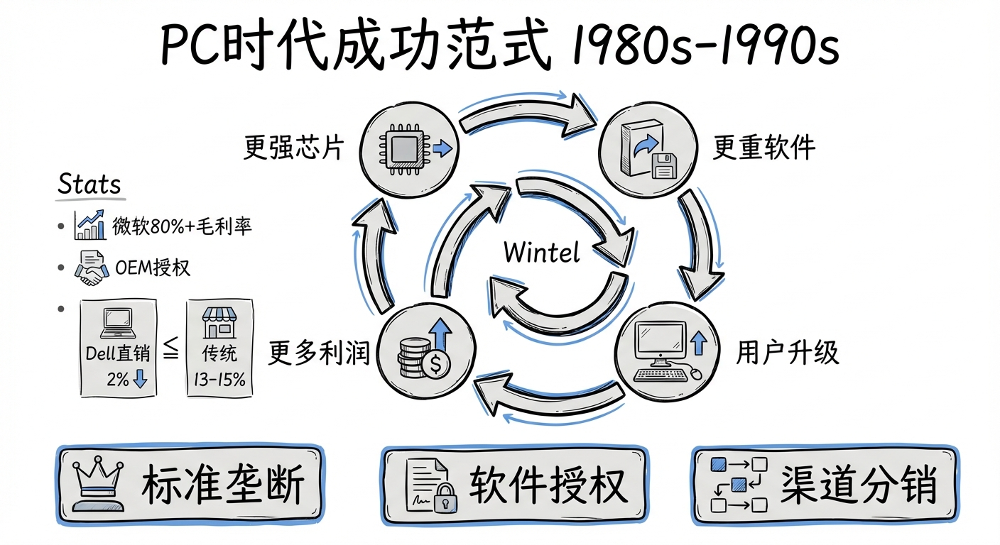
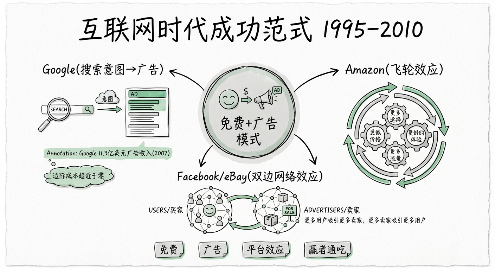
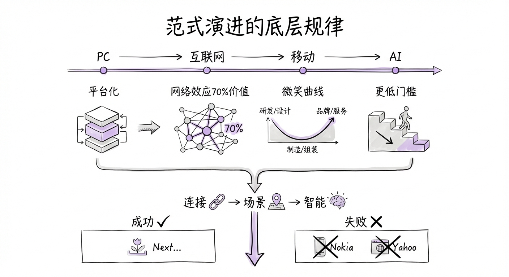
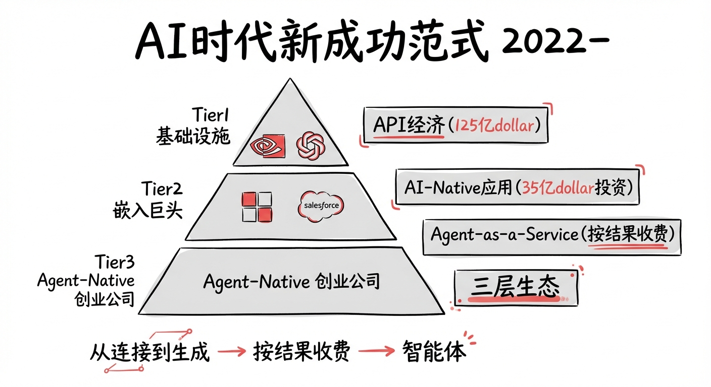
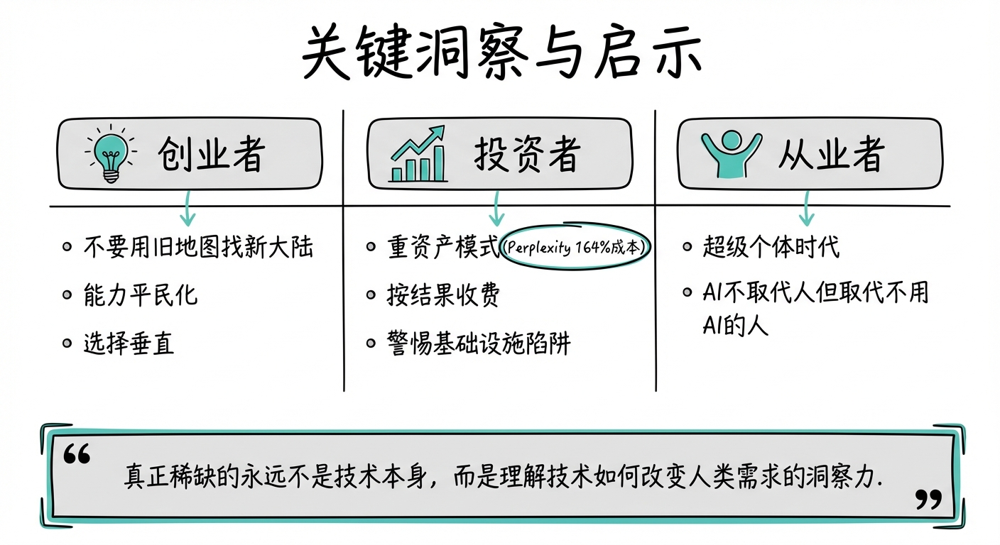

## 📋 Executive Summary

过去四十年的技术浪潮中，每一个时代都有自己独特的成功范式，但底层逻辑一脉相承：**谁掌控了价值链中最稀缺的环节，谁就赢得了时代**。PC时代的赢家靠"标准垄断+授权抽税"，互联网时代靠"免费获客+流量变现"，移动互联网时代靠"生态锁定+注意力收割"。而AI时代正在形成一个全新的逻辑：**从连接人与信息，转向替代人的认知劳动**。这意味着价值创造的核心从"平台"迁移到"智能体"，从"流量"迁移到"任务完成度"，商业模式也将从"按曝光收费"演进为"按结果收费"。历史规律告诉我们，每次范式转换中，上一代的王者往往不是下一代的赢家——除非它们有勇气"自我革命"。

<!-- truncate -->

## 🖥️ PC时代的成功范式（1980s-1990s）

### 核心成功模式：标准垄断 + 软件授权 + 渠道分销

PC时代的商业逻辑可以用一句话概括：**控制标准，然后对整个生态收税**。

**Wintel联盟**是这个时代最经典的成功范式。微软和英特尔并非传统意义上的合作伙伴——它们是经济学家Brandenburger和Nalebuff所说的"互补者"（complementors）。微软的Windows专为Intel芯片优化，Intel的新芯片为运行更复杂的Windows而设计。这种共生关系构成了一个"升级螺旋"：更强的芯片→更重的软件→用户被迫升级硬件→Intel卖出更多芯片→微软卖出更多许可证。在整个1990年代，仅微软和Intel两家公司的利润之和，就超过了PC产业链中所有其他玩家的利润总和。

**微软的关键策略**是一个天才般的商业决策链：1981年，比尔·盖茨从西雅图一家小公司以5万美元买下QDOS操作系统，改名MS-DOS授权给IBM——但合同中保留了向其他厂商销售的权利。这个条款改变了一切。当IBM PC架构被大量克隆时，每一台兼容机都需要微软的操作系统。微软随后推行"按机器收费"的OEM授权模式：硬件厂商每出货一台PC就要支付Windows许可费，无论用户是否真的使用Windows。这创造了一个近乎完美的"收税"模型——微软的毛利率长期维持在80%以上。

**Dell的直销创新**则代表了另一种成功路径。在IBM和Compaq通过层层渠道分销的年代，Dell发明了"按订单生产+直接配送"的模式，渠道成本仅占收入的2%，而传统渠道商高达13-15%。这让Dell在利润微薄的硬件市场中杀出一条血路。

### 为什么这些模式在当时有效？

PC时代的本质特征是**技术稀缺、用户专业、硬件驱动**。个人电脑是"奢侈品级"的生产力工具，用户对兼容性的需求远大于对差异化的需求。这意味着**标准化**是最大的价值——谁定义了标准，谁就拥有了定价权。操作系统具有天然的网络效应：用户越多→开发者越多→软件越丰富→用户越多。微软通过"捆绑销售+OEM锁定"构建了一条几乎无法逾越的护城河。

## 🌐 互联网时代的成功范式（1995-2010）

### 核心成功模式：免费 + 广告 + 平台效应 + 赢者通吃

互联网时代的核心范式转变是：**软件从"卖许可证"变成了"免费使用"**，而收入来源从用户直接付费转向了第三方（广告商）付费。这是商业史上最深刻的模式创新之一。

**Google**完美诠释了这个范式。作为搜索引擎市场的后来者，Google凭借PageRank算法提供了更好的搜索体验，然后通过AdWords/AdSense将用户意图转化为精准广告收入。关键洞察是：**搜索行为本身就是最纯粹的用户意图表达**。当用户搜索"买机票"时，航空公司愿意为展示在搜索结果旁边的广告付高价。Google创造了一个三边市场——用户获得免费搜索，广告商获得精准流量，Google从中抽成。到2007年，Google仅广告网络就产生了11.3亿美元收入。这个"用户注意力→广告变现"的飞轮至今仍然是互联网经济的基石。

**Amazon**代表了另一条路：**以亏损换规模，以规模建飞轮**。Bezos著名的"飞轮效应"理论是：更低的价格→更多的客户→更多的卖家入驻→更大的商品选择→更好的用户体验→更低的运营成本→更低的价格。Amazon连续亏损超过十年，但投资者买单了，因为飞轮一旦转起来，竞争对手几乎不可能追上。更关键的是，Amazon将自身的技术基础设施产品化——AWS从内部工具变成了全球最大的云计算平台，开创了"把成本中心变成利润中心"的范式。

**eBay和Facebook**则展现了**双边网络效应**的力量。eBay连接买家与卖家，Facebook连接用户与用户。这类平台的护城河不在于技术，而在于关系图谱——用户越多，平台越有价值，离开的代价越大。

### 从PC到互联网：范式发生了什么转变？

| 维度 | PC时代 | 互联网时代 |
|------|--------|------------|
| 价值来源 | 软件本身 | 用户数据和注意力 |
| 收费对象 | 终端用户 | 第三方（广告商） |
| 核心资产 | 知识产权（代码） | 用户规模（流量） |
| 竞争壁垒 | 技术标准锁定 | 网络效应 |
| 分发方式 | 物理渠道（光盘、预装） | 零边际成本（URL） |

最本质的变化是：**边际成本趋近于零**。PC时代每多一份软件拷贝还有光盘和渠道成本，互联网时代每多一个用户几乎不增加成本。这让"免费"成为可能，也让"规模"成为唯一的游戏。

## 📱 移动互联网时代的成功范式（2007-2020）

### 核心成功模式：应用商店生态 + 超级App + O2O + 注意力经济

2007年iPhone的发布是一个分水岭。但正如历史所示，真正的颠覆性应用并不立刻出现——Uber（2009）、WhatsApp（2009）、Instagram（2010）、Snapchat（2011）都是在智能手机普及后的数年才诞生的。

**Apple的应用商店模式**创造了一个全新的"数字地税"范式。App Store向所有数字商品和服务的交易抽取30%的佣金。到2024年，全球App Store生态系统促成了1.3万亿美元的账单和销售额。Apple不需要自己做任何一款杀手级应用——它只需要控制分发渠道，就能从整个生态中持续收税。这是PC时代微软OEM模式的升级版：从"每台设备收一次税"升级为"每笔交易都收税"。

**微信/WeChat**是移动互联网时代最极致的成功案例。它从一个简单的即时通讯工具演化为"超级App"——集通讯、社交、支付、电商、游戏、本地服务于一体，覆盖超过13亿用户。微信的成功揭示了移动时代的一个关键洞察：**用户不想下载更多的App，他们想在一个App里完成所有事情**。当用户获取成本在五年内上涨了300%以上，独立App的留存率持续走低，超级App成为了碎片化注意力时代的最优解。

**Uber和滴滴**则代表了**O2O（线上到线下）**的范式——利用移动设备的GPS和支付能力，将数字世界与物理世界连接起来。移动设备赋予了互联网"位置感知"能力，催生了共享经济、即时配送、本地生活服务等一系列新商业模式。

### 从互联网到移动互联网：范式如何演进？

移动互联网本质上是互联网的**分发革命**——把互联网装进每个人的口袋。它并没有改变"免费+广告"或"平台经济"的底层逻辑，而是叠加了三个新变量：

1. **随时在线**：用户使用时长从PC端的"每天几小时"变成了"全天候"，注意力成为最稀缺的资源
2. **位置感知**：GPS让"附近的餐厅""离你最近的司机"成为可能，催生了O2O生态
3. **碎片化场景**：用户在碎片时间中完成消费决策，推送通知和信息流成为新的"流量入口"

TikTok/抖音是这个时代晚期的巅峰之作——它用算法推荐彻底取代了社交关系图谱和搜索引擎，成为第一个真正意义上的"兴趣分发"平台，代表了注意力经济的终极形态。

## 🔄 范式演进的底层规律

### 跨时代的共性模式

纵观四十年技术浪潮，有几条底层规律一直在重复：

**1. 平台化是终极形态。** 每个时代的最大赢家都是"平台"：微软的Windows是软件平台，Google是信息平台，Apple是应用平台，微信是生活服务平台。平台的本质是"连接两边并收取过路费"。

**2. 网络效应造就赢者通吃。** 从Windows的开发者生态，到Facebook的社交图谱，到App Store的应用生态，网络效应是每个时代最强大的护城河。NFX基金的研究表明，科技公司70%的价值来源于网络效应。

**3. 价值在"微笑曲线"两端。** 在每个时代的产业链中，利润都集中在最上游（标准/平台/芯片）和最下游（直接面向消费者的品牌），而中间环节（组装、分销、运营）的利润被不断挤压。

**4. 新平台总是从"更低的门槛"切入。** PC让计算从大型机走向个人；互联网让信息获取从图书馆走向每个人；智能手机让"上网"从书桌走向口袋。每一次范式转换都在**降低使用门槛、扩大用户基数**。

### 每次转变的关键变量

- **PC→互联网**：关键变量是**连接**。当计算机联网后，软件的价值不再自我封闭，而是通过连接产生指数级增长。
- **互联网→移动互联网**：关键变量是**场景**。移动设备让互联网从"坐在桌前"变成"随时随地"，解锁了支付、出行、社交等线下场景。
- **移动互联网→AI**：关键变量是**智能**。AI不再只是连接和分发信息，而是理解、推理、生成——从"帮你找到答案"变成"直接给你答案"。

### 成功者的共同基因 vs 失败者的共同特征

**成功者**往往具备：(1) 对新技术"改变什么"有深刻洞察，而非简单移植旧模式；(2) 愿意牺牲短期利润换取长期规模（Amazon连续亏损十年）；(3) 构建了自我强化的飞轮效应。

**失败者**的共同点则是**创新者的窘境**：Nokia拥有最好的手机硬件，却无法理解"手机=口袋里的电脑"；Yahoo在搜索和门户上起步更早，却困在了"编辑精选"的旧范式中，没有拥抱算法驱动的新世界。每一代的失败者都是上一代的成功者——因为他们被自己的成功经验锁死了。

## 🤖 AI时代的新成功范式（2022-）

### 从"连接"到"生成"：价值创造逻辑的根本转变

如果说互联网时代的核心动作是"搜索"和"连接"，AI时代的核心动作则是"理解"和"生成"。这不是一个渐进的变化，而是一次根本性的跃迁。经济学家Carlota Perez的技术革命周期理论表明，我们可能正处于信息时代（1971年始于Intel微处理器）向AI时代过渡的"转折点"——类似于2000年互联网泡沫破裂后进入的"部署期"。

### 可能的商业模式矩阵

**1. API经济 / 模型即服务（Model-as-a-Service）**
OpenAI、Anthropic、Google等基础模型公司通过API"按token收费"，类似于AWS按计算资源收费。2025年，仅基础模型API市场就达到125亿美元。但这个模式面临一个严峻挑战——模型能力快速商品化，价格战已经打响。DeepSeek等开源模型的崛起正在持续压低API价格。

**2. AI-Native应用**
垂直行业的AI原生应用正在爆发。Menlo Ventures的数据显示，2025年垂直AI已成为35亿美元的投资类别，是上一年的三倍。这些公司不是在现有软件上"贴AI功能"，而是从零开始用AI重新设计工作流。Replit从200万美元年收入飙升到1.44亿美元，靠的就是"AI优先"的产品设计。

**3. Agent-as-a-Service / 按结果收费**
这是最令人兴奋的新模式：企业不再为AI技术本身付费，而是根据智能体实际达成的业务成果来付费。从"卖工具"到"卖结果"，这可能是AI时代最深刻的商业模式创新。正如一位分析师所言："当SaaS卖的是座位（seat），AI卖的是成果（outcome）。"

**4. 三层生态格局**
AI产业正在形成三层架构：
- **Tier 1**：超大规模基础设施提供商（算力、基础模型）——如Nvidia、OpenAI、Google
- **Tier 2**：将AI嵌入现有企业软件的巨头——如Microsoft（Copilot）、Salesforce（Einstein）
- **Tier 3**："Agent-Native"创业公司——从零开始用智能体架构设计产品

### 谁最可能赢？

历史规律给出一个矛盾的答案：**基础设施层的赢家最确定，但应用层的赢家最赚钱**。

在PC时代，Intel和Microsoft（基础设施层）最先确立优势；但在互联网时代，真正创造巨额财富的是Google和Amazon（应用层）。在移动时代，Apple和Google控制了操作系统，但微信、TikTok、Uber才是定义用户体验的公司。

类推到AI时代：Nvidia在算力层几乎不可撼动；OpenAI和少数几家基础模型公司会长期存在；但真正的"超级赢家"很可能出现在应用层——一个我们今天还叫不出名字的公司，可能正在某个车库里用AI重新发明某个行业。

### AI时代的"护城河"是什么？

传统护城河（品牌、规模、网络效应）在AI时代依然有效，但新的护城河正在涌现：

- **数据飞轮**：用户使用→产生独特数据→模型优化→产品更好→更多用户。Tesla的自动驾驶就是数据飞轮的经典案例——每一辆在路上行驶的Tesla都在为AI模型收集训练数据。
- **工作流嵌入**：深度整合到企业工作流中形成切换成本。Glean通过深度嵌入Slack、Salesforce、Zendesk等工具，即使竞争对手出现，迁移成本也让客户不愿离开。
- **速度本身就是护城河**：在AI快速迭代的时代，一个新模型、一个新开源项目就可能改变游戏规则。保持快速迭代能力，可能比任何静态资产都重要。
- **信任**：当AI代理处理越来越多的关键决策，用户和企业对AI系统的信任将成为稀缺资产。

## ⚡ 关键洞察与启示

### 对创业者的启示

**不要用旧地图找新大陆。** 每次范式转换中，"把旧模式搬到新平台"的创业者几乎全部失败——把报纸搬上互联网的门户网站输给了Google，把网站缩小放进手机的App输给了微信。AI时代的赢家不会是"在现有产品上加一个AI按钮"的公司，而是那些用AI从根本上重新想象工作流程的公司。

**关注"不可能变成可能"的时刻。** PC让个人拥有了计算力，互联网让每个人都能发布内容，移动互联网让打车可以一键完成。AI正在让什么"不可能"变成"可能"？答案是：**非专业人士也能完成专业工作**——写代码、做设计、做法律分析、做财务模型。围绕这种"能力平民化"构建产品，是AI时代最大的创业机会。

**选择垂直，而非水平。** 水平层的竞争已经白热化，基础模型公司之间的价格战让利润空间急剧收窄。但在垂直行业——法律、医疗、金融、教育——AI的价值创造空间巨大，且行业know-how构成天然护城河。

### 对投资者的启示

**AI的投资逻辑与移动互联网不同。** 移动互联网时代投资者偏爱"轻资产"模式，而AI时代的基础设施需要巨额资本投入——训练和推理的算力成本让AI公司的成本结构更像能源公司而非软件公司。Perplexity 2024年在AWS和模型API上的支出高达其收入的164%。这意味着投资人需要更长的耐心和更大的资金承诺。

**关注"按结果收费"的公司。** 从SaaS的"按座位收费"到AI的"按结果收费"，商业模式的进化方向是明确的。那些能够把AI能力封装成可量化商业成果的公司，将拥有最强的定价权和最深的护城河。

**警惕"基础设施陷阱"。** 向量数据库、AI框架等中间层工具可能在一夜之间失去差异化优势。基础模型公司每一次升级都可能让一批中间件工具变得多余。

### 对从业者的启示

**"超级个体"时代来临。** 周鸿祎预言："一名人类员工带领上百个智能体协同工作将成为常态。"这不是遥远的未来——AI编码助手已经让单个开发者的产出接近过去一个小团队的水平。未来最有价值的能力不是"执行"，而是"定义问题"和"协调智能体"。

**理解AI不会取代人——但会取代不会用AI的人。** 正如PC时代不会打字的人被边缘化，互联网时代不会上网的人被边缘化，AI时代不会使用AI工具的人将面临同样的命运。

**每个技术时代的终极启示是一样的：真正稀缺的永远不是技术本身，而是理解技术如何改变人类需求的洞察力。**

## 📚 Sources & References

1. Acquired Briefing - "Microsoft I (1975-1995)" <https://www.acquiredbriefing.com/p/microsoft-i-1975-1995>
2. Wikipedia - "Wintel" <https://en.wikipedia.org/wiki/Wintel>
3. Yahoo Finance - "The Ghosts of Wintel" <https://finance.yahoo.com/news/ghosts-wintel-leaders-learn-diverging-110000375.html>
4. Harvard Business School - "Wintel: Cooperation or Conflict" <https://www.hbs.edu/ris/Publication%20Files/05-083.pdf>
5. Stanford CS - "The Making of Microsoft" <https://cs.stanford.edu/people/eroberts/cs181/projects/corporate-monopolies/development_microsoft.html>
6. Cascade Strategy - "How Microsoft Innovations Made It a Technology Giant" <https://www.cascade.app/studies/how-microsoft-innovations-made-it-technology-giant>
7. Forbes - "The 7 Most Successful Business Models of The Digital Era" <https://www.forbes.com/sites/bernardmarr/2023/03/14/the-7-most-successful-business-models-of-the-digital-era/>
8. FourWeekMBA - "Google Business Model" <https://fourweekmba.com/google-business-model/>
9. FourWeekMBA - "Amazon Flywheel" <https://fourweekmba.com/amazon-flywheel/>
10. Wikipedia - "Platform Economy" <https://en.wikipedia.org/wiki/Platform_economy>
11. Apple Newsroom - "A Global Perspective on the Apple App Store Ecosystem" <https://www.apple.com/newsroom/pdfs/apple-app-store-study-2020.pdf>
12. MacRumors - "App Store Global Ecosystem Study 2024" <https://www.macrumors.com/2025/06/05/app-store-global-ecosystem-study-2024/>
13. PMC/NIH - "Digital Platforms' Growth Strategies and the Rise of Super Apps" <https://pmc.ncbi.nlm.nih.gov/articles/PMC10907532/>
14. NFX - "The Network Effects Manual" <https://www.nfx.com/post/network-effects-manual>
15. a16z - "The Dynamics of Network Effects" <https://a16z.com/the-dynamics-of-network-effects/>
16. Digital Bricks - "The Mobile Revolution vs. The AI Revolution" <https://www.digitalbricks.ai/blog-posts/the-mobile-revolution-vs-the-ai-revolution>
17. ScienceDirect - "Is AI Leading to a New Technological Paradigm?" <https://www.sciencedirect.com/science/article/pii/S0954349X24001826>
18. Menlo Ventures - "2025: The State of Generative AI in the Enterprise" <https://menlovc.com/perspective/2025-the-state-of-generative-ai-in-the-enterprise/>
19. GIS Reports - "Trillion-Dollar Question for AI Business Models" <https://www.gisreportsonline.com/r/ai-business-models/>
20. MachineLearningMastery - "7 Agentic AI Trends to Watch in 2026" <https://machinelearningmastery.com/7-agentic-ai-trends-to-watch-in-2026/>
21. Stripe - "AI Business Models That Create Value" <https://stripe.com/resources/more/building-ai-business-models>
22. Hampton Global Business Review - "The AI Flywheel: How Data Network Effects Drive Competitive Advantage" <https://hgbr.org/research_articles/the-ai-flywheel-how-data-network-effects-drive-competitive-advantage/>
23. Insignia VC - "Is Proprietary Data Still a Moat in the AI Race?" <https://review.insignia.vc/2025/03/10/ai-moat/>
24. 36氪 - "AI对行业的机遇与冲击：2026五大应用板块全景扫描" <https://36kr.com/p/3680115716206212>
25. MIT/Dell Case Study - "Dell Direct" <https://web.mit.edu/course/15/15.823/attach/Dell%20CASE.pdf>
