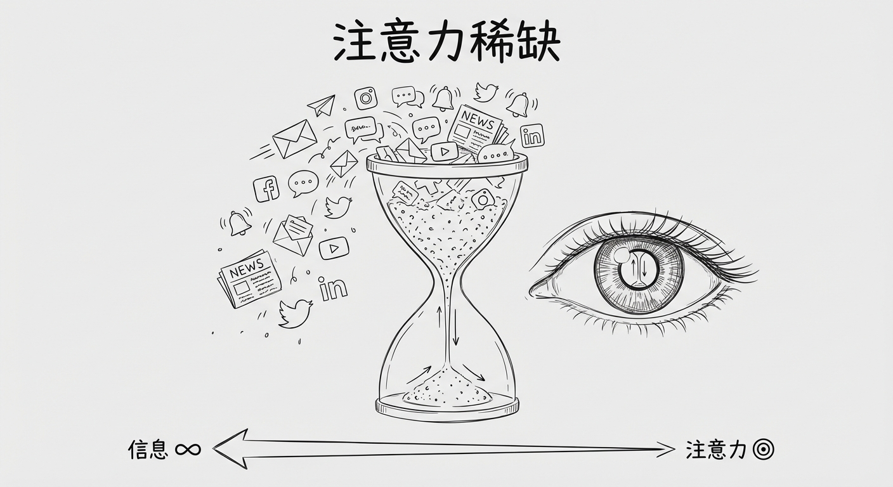
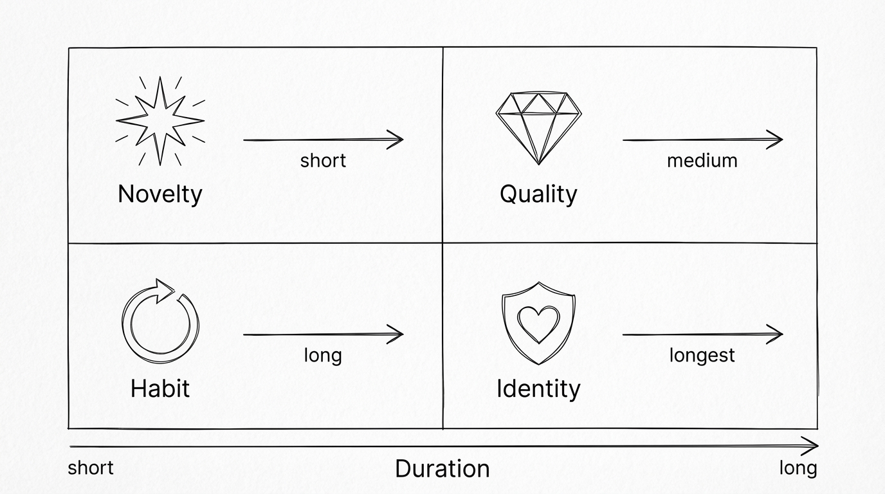
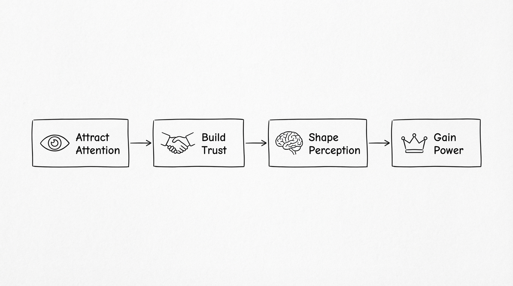
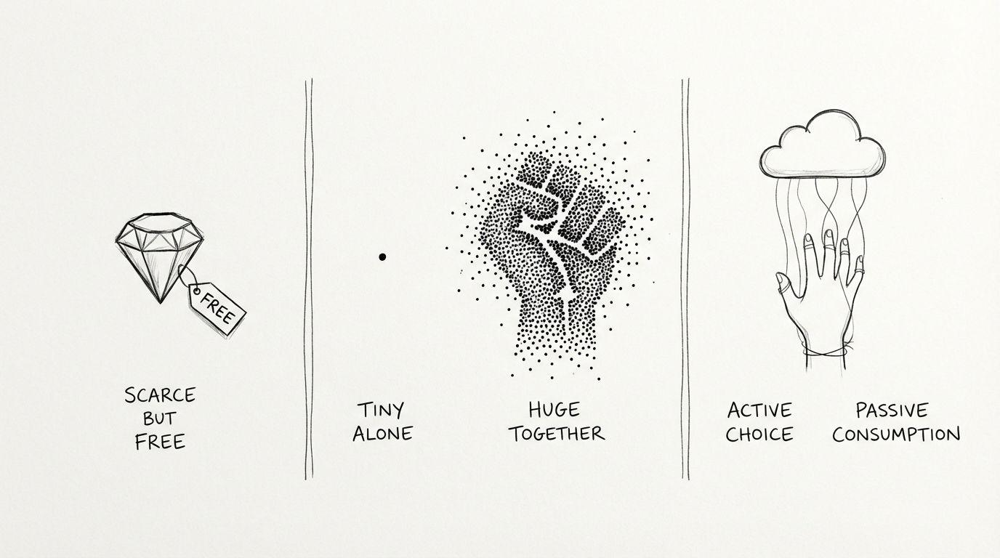
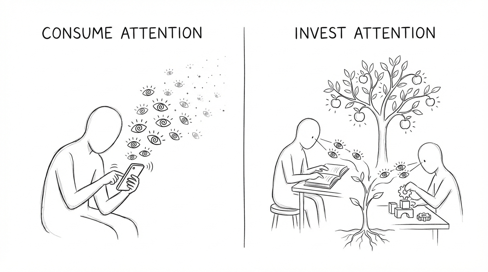

## 💡 核心观点

注意力是人类最稀缺的资源，某种程度上等同于时间。每个人每天拥有相同的24小时，注意力总量也是有限的。好的内容、好的产品能够吸引注意力，新奇事物天然具有吸引注意力的优势。**谁能持续吸引注意力，谁就拥有权力和影响力。** 注意力不仅是一种认知资源，更是一种可以转化为经济价值和社会权力的"货币"。

<!-- truncate -->

## 🔍 背景与理论基础

### 注意力经济的起源

早在1971年，诺贝尔经济学奖得主 Herbert A. Simon 就提出了一个惊人的洞察：

> "信息的丰富造成了注意力的贫乏，因此需要在过量的信息源中有效地分配注意力。"（[Herbert Simon, Goodreads](https://www.goodreads.com/author/quotes/89879.Herbert_A_Simon)）

这句话写于互联网诞生之前，却精准预言了今天的现实。Simon 指出，大多数系统设计者错误地将问题定义为"信息稀缺"，而真正稀缺的是"注意力"——他们应该设计过滤无关信息的系统，而非提供更多信息的系统（[Wikipedia: Attention Economy](https://en.wikipedia.org/wiki/Attention_economy)）。

### 从信息经济到注意力经济

我们已经从"信息经济"过渡到了"注意力经济"。联合国经济学家网络的报告指出，人类注意力已成为一种[稀缺商品](https://www.un.org/sites/un2.un.org/files/attention_economy_feb.pdf)，需要用经济学理论来理解和管理。Matthew Crawford 也说过："注意力是一种资源——每个人拥有的是有限的。"

## 🏗️ 注意力 = 时间 ≈ 权力：一个框架

### 第一层：注意力与时间的等价性

注意力与时间几乎等价。这不是简单的类比——它揭示了一个结构性事实：

* **时间是绝对民主的**：每人每天24小时，无论贫富

* **注意力是时间的"有效载荷"**：时间流逝是被动的，注意力投入是主动的

* **注意力比时间更稀缺**：你的8小时工作时间可能只投入2小时注意力

因此，注意力实际上是**时间的质量维度**。一个人的注意力时间（真正专注的时间）可能只有每天3-5小时，这才是真正的稀缺资源。

### 第二层：注意力的四种吸引力

"好的内容"、"好的产品"和"新的事物"——可以扩展为注意力吸引力的四个来源：

| 吸引力类型    | 机制          | 持续性       | 举例            |
| -------- | ----------- | --------- | ------------- |
| **新奇性**  | 大脑对新刺激的本能反应 | 短暂（分钟级）   | 热搜、突发新闻、新产品发布 |
| **质量**   | 内容/产品本身的价值  | 中等（天-周级）  | 好文章、好工具、好电影   |
| **习惯性**  | 行为回路的自动触发   | 长期（月-年级）  | 刷朋友圈、查邮件、打开抖音 |
| **身份认同** | 与自我认知的深层绑定  | 持久（年-终身级） | 宗教、政治信仰、品牌忠诚  |

真正强大的注意力吸引者会在多个层次同时运作。比如 iPhone：新品发布（新奇性）→ 产品好用（质量）→ 生态锁定（习惯性）→ "我是苹果用户"（身份认同）。

### 第三层：注意力 → 权力的转化路径

> **注意力 → 影响力 → 权力**

注意力向权力的转化并非一步到位，而是沿着一条清晰的递进路径层层攀升：

具体路径：
1. 吸引注意力 → 获得关注（粉丝/用户/读者）
2. 持续吸引 → 建立信任（品牌/权威/IP）
3. 引导注意力 → 塑造认知（议程设置/框架效应）
4. 垄断注意力 → 获得权力（平台/媒体/政治）

每一层都是下一层的前提——没有关注就没有信任，没有信任就无法塑造认知，而认知的垄断，最终通向权力本身。

这就是为什么：

* **社交媒体平台**是当代最有权力的实体之一——它们控制注意力的分配

* **算法推荐**本质上是注意力的中央计划经济

* **网红/KOL**的权力来源是可调配的注意力规模

* **政治家**的核心能力之一就是吸引和维持公众注意力

## 📊 现实中的注意力战争

### 注意力市场的残酷数据

Berkeley 经济评论指出，注意力的价值可以从我们"支付"给事物的时间来衡量——当我们"注意"一件事时，必然"忽略"另一件（[Berkeley Economic Review](https://econreview.studentorg.berkeley.edu/paying-attention-the-attention-economy/)）。

Oxford 学术期刊的最新研究（2025）更进一步，提出注意力已经成为社交媒体上的一种"通用符号货币"（Universal Symbolic Currency），可以被量化、交易和积累（[Interacting with Computers, Oxford Academic](https://academic.oup.com/iwc/article/37/1/18/7733851)）。

### 谁在赢得注意力战争？

当前最成功的注意力捕获者：

1. **短视频平台**（TikTok/抖音）——利用新奇性+算法精准投喂，将注意力碎片化到极致
2. **AI 聊天工具**（ChatGPT 等）——用实用性+新奇性获取大量注意力
3. **游戏**——用沉浸感+成就系统构建注意力黑洞
4. **社交媒体信息流**——用社交焦虑+算法构建习惯性注意力消耗

## ⚖️ 深层矛盾与反思

### 注意力的悖论

1. **稀缺但免费**：注意力是最稀缺的资源，但人们免费"支付"它。你从不付费刷抖音，但你支付了最宝贵的东西。
2. **个体无感但集体巨大**：单个人的注意力微不足道，但百万人的注意力聚合就是巨大的权力。
3. **主动选择但被动消耗**：人们以为自己在"选择"看什么，实际上算法在决定他们"看到"什么。

### 注意力权力的伦理问题

* 如果注意力 = 权力，那么**操纵注意力 = 操纵权力**

* 平台设计的每一个"成瘾机制"都是在**窃取注意力**

* 注意力贫乏导致**深度思考的消亡**——人们失去了集中注意力30分钟以上的能力

### 反面观点

也有学者认为注意力经济的框架过于简化：

* 注意力并非同质的——深度阅读1小时 ≠ 刷短视频1小时

* 不是所有注意力都能转化为权力——无目的的关注不产生影响力

* 权力还需要其他要素：资源、组织能力、合法性

## 🚀 启示与应用

### 对个人

* **注意力管理 > 时间管理**：真正要管理的不是时间，而是注意力的投向

* **消费注意力 vs 投资注意力**：刷信息流是消费，学习技能是投资

* **警惕注意力被窃取**：意识到每个 App 都在争夺你的注意力

### 对创作者/创业者

* **核心资产是别人的注意力**：粉丝/用户的注意力就是你的资本

* **注意力的质量比数量重要**：1000个真正关注你的人 > 100万路过的人

* **注意力需要持续经营**：一次爆发不够，需要建立可持续的注意力关系

### 对社会

* **注意力分配即权力分配**：谁设计算法，谁就在重新分配社会权力

* **注意力保护应成为基本权利**：正如环境保护一样，认知环境也需要保护

* **教育的核心任务之一**：教会人们如何掌控自己的注意力，而非被动消耗

## 💭 进一步思考

这个想法可以继续深入的方向：

1. **注意力货币化**：如果注意力是货币，能否设计一种机制让人们"出售"自己的注意力时获得公平补偿？（目前被平台免费占有）
2. **注意力民主化**：算法决定了注意力流向，能否让用户真正掌控自己的注意力分配？
3. **注意力与AI**：AI 时代，机器可以有无限的"注意力"——这会如何改变注意力经济的格局？当 AI 代替人类消费内容时，人类注意力的价值会进一步上升还是贬值？
