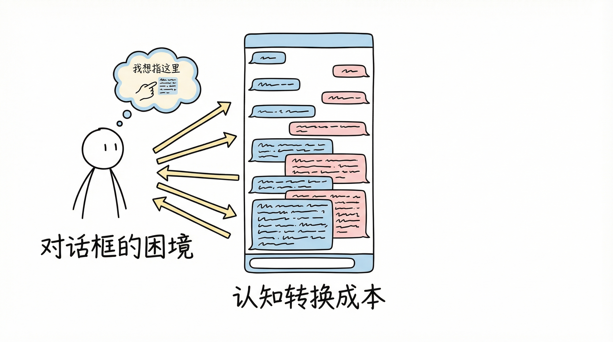
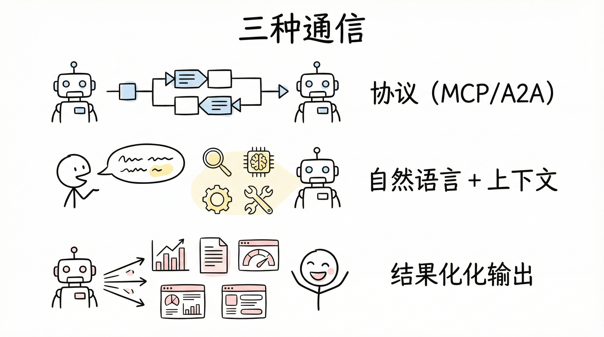
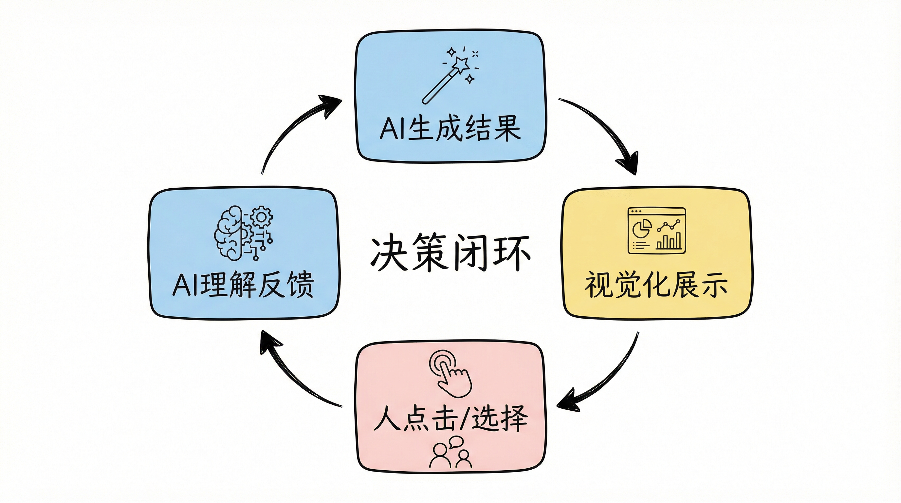
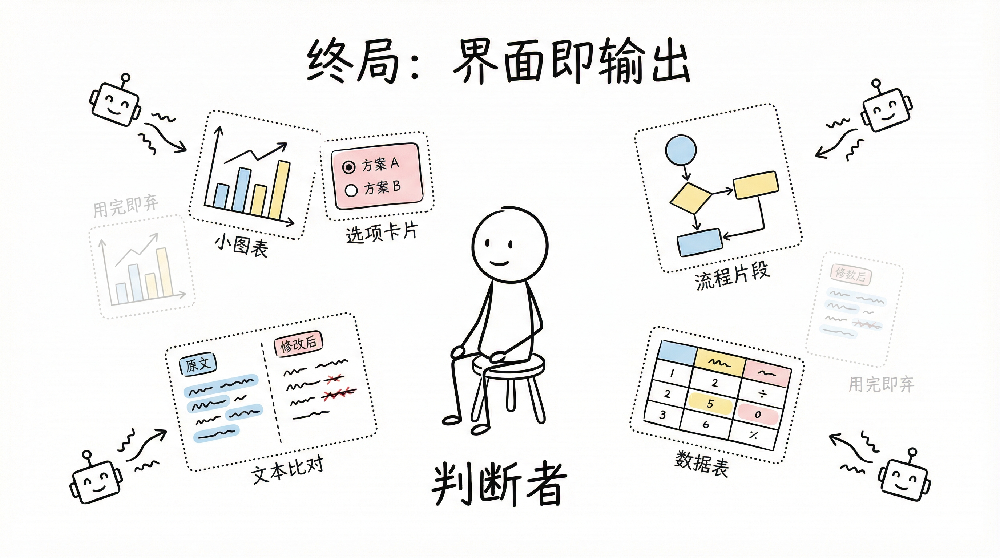

## 一个被忽视的不对称

我们正处在一个奇特的时刻：AI之间的协作已经非常高效，但人与AI的协作仍然笨拙得像在用电报。

2025年，Google Cloud发起的[A2A（Agent-to-Agent）协议](https://www.ibm.com/think/topics/agent2agent-protocol)获得了Atlassian、Salesforce、SAP等50多家企业支持；Anthropic在2024年底发布的[MCP（Model Context Protocol）](https://medium.com/@aftab001x/mcp-and-a2a-the-protocols-building-the-ai-agent-internet-bc807181e68a)正在成为AI获取工具和上下文的标准框架，其生态中的AgentSkill机制更进一步——让AI Agent能够按需发现、安装和使用模块化的能力包，就像人类安装App一样自然。

但转头看人与AI的协作——我们还在对着一个文本框打字。

这种不对称才是当下人机交互最根本的矛盾。AI之间靠协议通信，协议天然可编程、可扩展、可并行；而人是视觉动物，依赖直觉和感官，用线性的自然语言来表达本质上是并行、层次化的意图。这种介质上的错配，决定了当前所有"对话式AI"产品的天花板。


<!-- truncate -->

## 单次交互已经解决了

先承认一个事实：单次交互的问题已经基本解决。

人通过自然语言说出意图，AI自动补充上下文——调用搜索、查阅记忆、访问工具链——然后输出结果。这个"人→AI→结果"的单次循环已经足够成熟。ChatGPT、Claude、各种Agent框架都在做这件事，而且越做越好。

[IBM Research的Ismael Faro](https://www.ibm.com/think/news/ai-tech-trends-predictions-2026)指出，软件正从非正式交互转向结构化方法——用户设定目标并验证进度，自主智能体执行任务并在需要时请求人类批准。[Gartner预测](https://www.usaii.org/ai-insights/top-10-ai-trends-to-watch-in-2026)，2026年40%的企业应用将集成任务专用AI Agent。

单次交互的三个环节——理解意图、补充上下文、输出结果——正在被Agentic AI快速推进。但真正的瓶颈不在单次，而在频次。

## 频繁交互的瓶颈：对话框的困境

当一个任务需要人反复给AI反馈、做出选择、调整方向时，纯文字对话就成了瓶颈。

想象你在用AI写一篇文章。你说"帮我写篇关于注意力经济的文章"，AI写了一版。你觉得第三段不太对，于是打字："第三段的论点太弱了，能不能换一个角度，从平台权力的视角来论述？"AI重写了。你又觉得开头太平，再打一段修改意见。来回十几轮。



这个过程的问题不是AI不够聪明，而是**交互介质效率太低**。你需要把一个视觉上可以直接"指"出来的问题，翻译成文字描述，然后等AI理解、执行、返回。每一轮都有认知翻译成本。

对话框有四个结构性问题：

**认知负荷高**。人需要把视觉直觉翻译成文字再打字输入。你明明看一眼就知道"这个配色不对"，但要描述给AI听，可能需要写一整段话。

**信息密度低**。一屏文字能传递的结构化信息远不如一个可视化界面。对话是线性的，但决策常常是并行的——你需要同时比较多个选项，在对话框里这几乎不可能高效完成。

**决策效率低**。在对话中做选择题，本质是用线性媒介处理并行信息。AI给你列了五个方案，你得逐个读完、记住差异、然后做判断——这本该是一眼扫过五张卡片的事。

**上下文丢失**。长对话中人很容易忘记前面说了什么，AI也受限于context window。协作的连续性被切割成一条条消息。

Springer Nature的研究将人-AI协作定义为一种["超越传统输入-输出模型，拥抱轮流、即兴和社会协作的新交互范式"](https://link.springer.com/rwe/10.1007/978-981-97-8440-0_76-1)。这意味着我们需要重新思考交互的基本单元——不是"一条消息"，而是"一个决策"。

## 三种通信的本质差异

要解决这个问题，得先看清三种通信的本质差异。

**AI与AI**：靠协议。MCP解决AI获取工具和上下文的问题，A2A解决Agent之间对话协作的问题，[ACP提供轻量级通信](https://www.ruh.ai/blogs/ai-agent-protocols-2026-complete-guide)。三者定位清晰，构成了"AI互联网"的协议栈。协议的本质是结构化、可编程、无歧义——机器处理这些是零成本的。

**人到AI**：靠自然语言+AI自动补context。人不会说JSON，人用模糊的自然语言表达意图。AI的工作是理解这个模糊意图，然后主动补充所有需要的上下文——通过记忆、工具、搜索、环境感知。这一层的进化方向是让AI更擅长"猜"：[Amazon Alexa+](https://techspective.net/2025/10/04/the-ambient-brain-why-amazons-alexa-is-the-ai-weve-been-waiting-for/)已经能在数周内保持对话上下文，用户说"提醒我找一下我们周二讨论的那条徒步路线"，AI能准确理解指代关系。[多模态交互](https://www.mdpi.com/2414-4088/9/1/6)——语音、手势、视觉、眼动——正在扩展人表达意图的通道。

**AI到人**：靠结果化输出。这是最关键、也最被忽视的一环。AI不应该只是"回答"人的问题，而应该把工作成果以人最容易消化的形式呈现——视频、文档、图表、可操作的界面。生成式AI已经从文本扩展到全媒体：[Google DeepMind的Genie 3和World Labs的Marble](https://www.technologyreview.com/2026/01/05/1130662/whats-next-for-ai-in-2026/)能生成逼真的虚拟世界场景。AI→人的输出，正在从"文字回复"进化为"多模态结果"。



三种通信各有最优介质。AI之间用协议没有问题，人到AI用自然语言也在快速进步。但AI到人——尤其是在频繁交互场景中——还缺一个关键的范式跃迁。

## UI的本质应该改变：围绕结果而非围绕操作

频繁交互需要UI，这一点不难达成共识。但什么样的UI？

先退一步思考AI协作的产出物。文章、代码、图片、视频、音频、数据报表、软件——任何可以被数字化编码的东西。Shapiro和Varian在《Information Rules》中指出，这类数字信息产品的核心经济特征是**高固定成本、几乎零边际成本**。这正是AI的主战场——生成式AI已经能直接产出几乎所有子类的数字信息产品，质量从"可用"到"优秀"不等。

既然AI能直接生成结果，那UI的设计重心就应该从"帮人操作"转向"帮人审视结果"。传统UI是人类程序员预先设计的固定界面——你打开一个App，按钮在那里、菜单在那里、流程在那里——无论你是谁、要做什么，界面都一样。这种模式的好处是稳定、可预测，但代价是僵化、不可适应。

AI时代的UI应该是另一种东西：**AI根据当前任务、当前上下文、当前用户，动态生成的决策界面**。而这种界面的核心逻辑是围绕结果展开的——不是给你一套工具让你自己造，而是直接把成果摆在你面前，让你判断和调整。


这套设计哲学可以概括为三个原则：

**结果先行**。AI先展示它认为最优的结果，人只需要纠偏，而不是从零构建。不是给你一个空白画布让你描述需求，而是直接给你一个90分的成果，你只需要告诉AI哪里不对。

**最小操作原则**。人的每次操作应该传递最大信息量。点击优于选择，选择优于拖拽，拖拽优于打字。把人的认知负荷降到最低——看到、判断、点击，三步完成一个决策。

**动态生成**。每个决策时刻的界面都是为这一刻量身定制的。写文章时，界面是段落级的对比视图；分析数据时，界面是可交互的图表dashboard；编排工作流时，界面是可拖拽的流程图。用完即弃——下一个决策点，AI生成下一个界面。

这不是科幻。[FPT Software的研究](https://fptsoftware.com/resource-center/blogs/top-ai-trends-in-2026)显示，AI驱动的超个性化已经在金融领域实现了92%的数字互动提升。个性化正在从内容层深入到界面层——AI根据用户行为习惯动态调整UI布局，根据认知负荷水平调整信息密度，根据技能水平切换专家/新手模式。

## 决策反馈闭环：真正的协作模式

把这些拼在一起，一个完整的人-AI协作模型浮现出来：

```
AI生成结果 → 视觉化展示 → 人点击/选择 → AI理解反馈 → 更新结果 → ...
```



这个闭环的关键在于：人的角色从"指令发出者"变成了"决策确认者"。AI做了95%的工作，人只需要在关键节点做判断——接受、拒绝、调整方向。而这些判断通过视觉化的界面来完成，不需要打字，只需要看和点。

举个具体的例子：你让AI分析销售数据。传统方式是AI给你一大段文字分析，你看完后再问"按地区拆分呢"，又回来一堆文字。新方式是AI直接生成交互式dashboard，图表支持点击下钻、筛选、切换维度。你在图表上圈一个异常区域，AI自动分析原因并展示在旁边。决策选项以卡片形式呈现，每张卡片显示预期影响。整个过程你几乎不需要打一个字。

关键区别在这里：传统GUI的信息架构是死的——程序员设计时就固定了；AI决策界面的信息架构是活的——每次根据上下文动态生成。前者是"人适应界面"，后者是"界面适应人"。

## 真正的终局

人与AI协作的终极形态，不是人适应AI的协议，也不是AI适应人的语言——而是**AI为人动态构建最低摩擦的决策通道**。



UI本身变成了AI的一种"输出模态"：AI不仅输出文字、图片、代码，还输出界面。界面是为当前这一个决策时刻量身定制的，用完即弃。人的角色从操作者变成判断者——AI负责做事，人负责把关。

[微软研究院](https://www.microsoft.com/en-us/research/story/whats-next-in-ai/)描绘的愿景是：AI不是执行任务的工具，而是"与我们一起协作、推理和成长的可信伙伴"。但伙伴关系需要高效的沟通方式。当AI之间已经有了MCP和A2A这样的"母语"，人与AI之间也需要找到自己的"母语"——不是自然语言文本，不是固定的GUI按钮，而是一种动态的、视觉化的、以决策为单元的交互界面。

这或许是人机交互领域下一个真正值得解决的问题。
